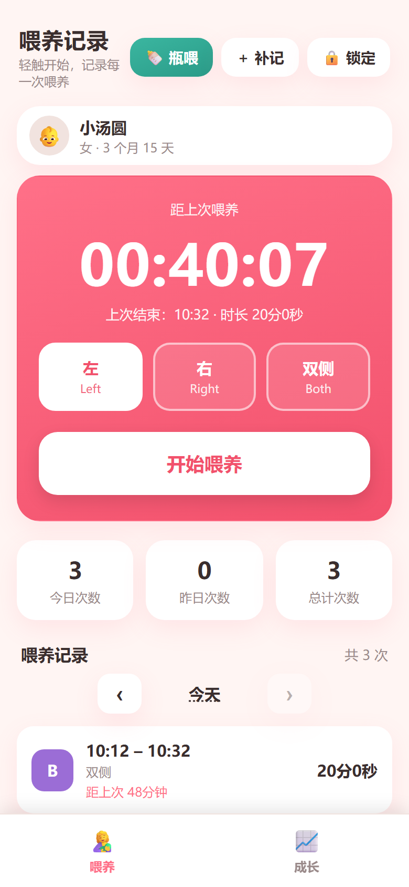
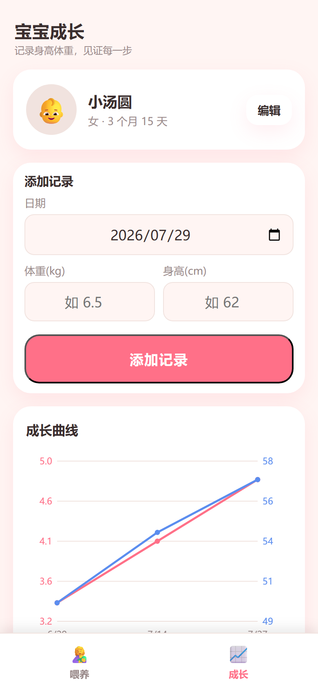
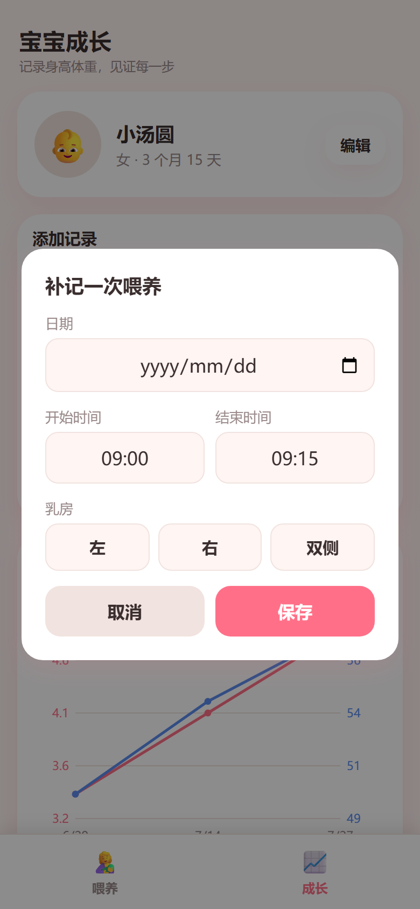
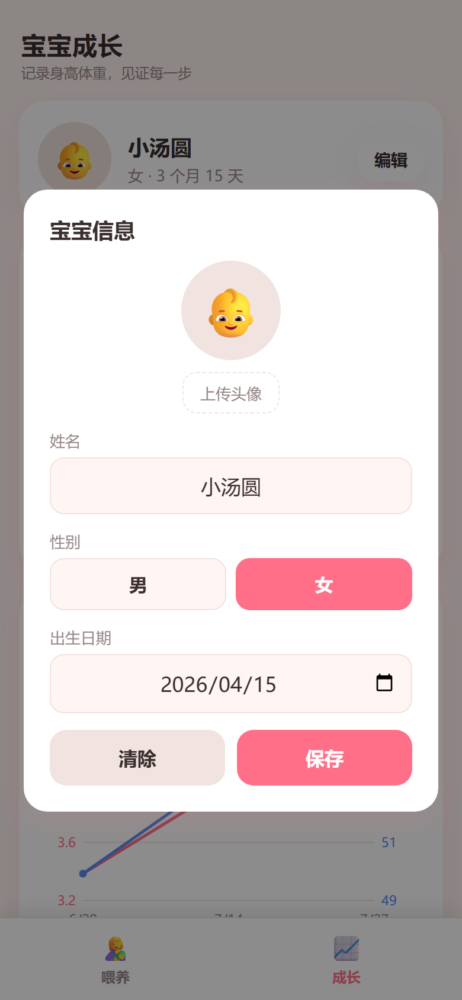

# 母乳喂养记录软件-安卓版

一款专为新手爸妈设计的母乳喂养记录工具。界面简洁、单手即可操作，支持亲喂/瓶喂计时、成长曲线追踪、WebDAV 多端同步以及本地备份恢复。

> 仓库为开源项目，采用 [MIT 协议](LICENSE)。

## 功能页面

### 🤱 喂养记录
- 左侧 / 右侧 / 双侧一键选择，轻触「开始喂养」即计时
- 实时显示本次喂养时长或距上次喂养的间隔
- 今日 / 昨日 / 总计次数统计
- 按日查看历史记录，支持补记、删除
- 右上角「锁定」按钮：进入只读模式，防止误触，自动同步仍继续运行

### 📈 宝宝成长
- 记录体重（kg）、身高（cm）
- 自动生成成长曲线
- 按时间线查看历次成长记录

### 👶 宝宝信息
- 设置宝宝姓名、性别、出生日期、头像
- 宝宝信息仅保存在本地，不参与 WebDAV 多端同步

## 安装

1. 打开 [GitHub Releases](https://github.com/XuKequan/TestApk/releases/latest)
2. 下载最新版 `app-debug.apk`
3. 在安卓手机上安装（首次安装需允许「安装未知来源应用」）
4. 打开 App，设置宝宝信息后即可使用

### 升级保留数据
- 若新旧版本签名一致，直接覆盖升级即可保留数据。
- **安全建议**：升级前使用 App 内的「导出全部」功能备份 JSON 文件；升级后通过「导入」恢复。
- 若系统提示「与已安装应用签名不同」，则需要先卸载旧版。卸载前**务必导出备份**，否则本地数据会被清空。

## 使用说明

### 记录一次亲喂
1. 在喂养页选择「左」「右」或「双侧」
2. 点击「开始喂养」按钮开始计时
3. 喂养结束后再次点击按钮停止，App 自动保存本次时长与乳房

### 补记一次喂养
点击右上角「+ 补记」，选择日期、开始/结束时间、乳房后保存。适合补录之前漏记的记录。

### 记录瓶喂
点击右上角「瓶喂」按钮，填写奶量与时间后保存。

### 添加成长记录
切换到「成长」页，选择日期并填写体重、身高，点击「添加记录」。成长曲线会自动更新。

### 锁定模式
点击喂养页右上角「锁定」按钮：
- 所有操作按钮被禁用，仅可查看数据
- 自动同步仍会继续运行
- 锁定状态下同步为**只读**，不会把本地修改上传到服务器

### 数据备份与恢复
- **导出全部**：将喂养记录、成长记录、宝宝信息打包为 JSON 文件保存到手机。
- **导入**：选择已导出的 JSON 文件即可恢复全部数据。

### WebDAV 多端同步（可选）
在 App 内填写 WebDAV 服务器地址、用户名、密码并保存：
- 同步内容仅包含**喂养记录**和**成长记录**
- 宝宝信息**不会**同步，始终只保存在本地
- 默认每 1 分钟自动同步一次
- 支持同步到 NAS、Nextcloud、坚果云等支持 WebDAV 的服务

## 截图

<p align="center">
  
  
</p>

<p align="center">
  
  
</p>

## 技术说明

- 前端：PWA（HTML/CSS/JavaScript），可离线运行
- 安卓壳：Android WebView（`android/` 源码）
- 数据存储：WebView localStorage（应用私有目录）
- 同步协议：WebDAV（GET/PUT/MKCOL/PROPFIND）
- 合并策略：基于 `updatedAt` 的 Last-Write-Wins + 软删除墓碑 `_deleted`

## 开发 / 构建

### 本地生成截图
```bash
python screenshot.py
```
会在 `screenshots/` 目录生成各页面 PNG。

### 本地构建 APK
项目主要依赖 GitHub Actions 构建，工作流配置见 `.github/workflows/main.yml`。
如需要在本地构建，可参考 `android/` 目录下的 Gradle 工程自行配置。

## 开源许可

[MIT](LICENSE) © XuKequan
